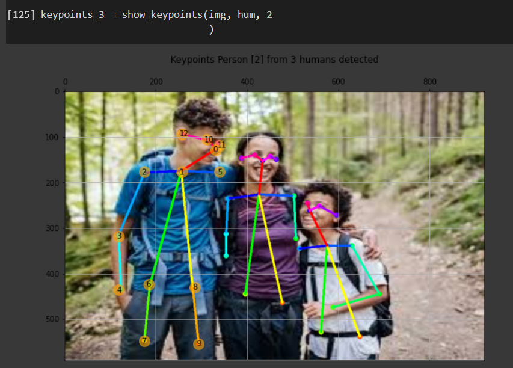
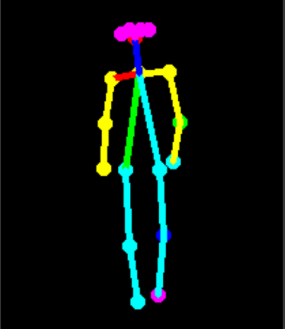
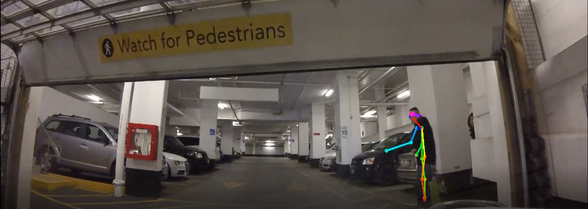
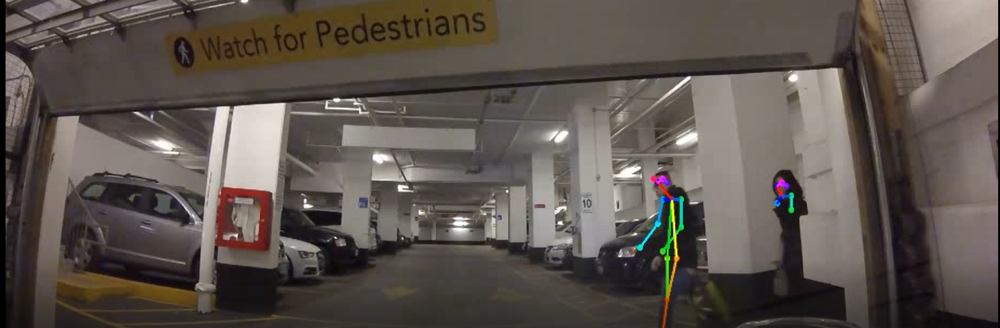
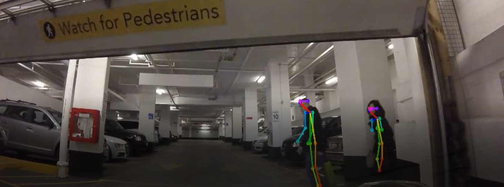
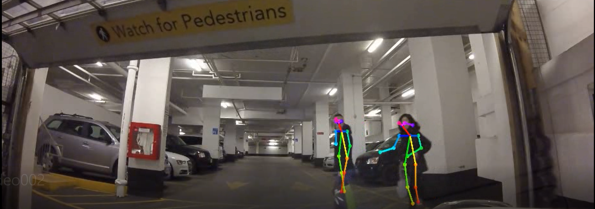
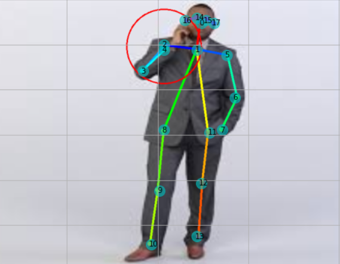
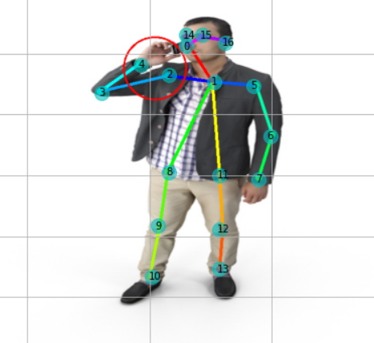

# Pedestrian-Detection-using-tf_pose
A approach to detect the pedestrians using tensorflow pose, in order to assist fully or semi automatic driving systems. Further working to use the key-points to classify attentive and non attentive pedestrians on road.

Here we have tf_pose to detect pedestrians in videos , tf_pose returns the key-points that are the key body parts position of a person using the heat map of a body when detected.
Following is some example of pose detection in images and body heat maps.

Further the same model is used to detect multiple people together in a video.Following I have shown some of the frames of resultant videos.

I will soon add some code in which, These key-points can will be used to detect the pose and detect whether they are attentive on road or not. The system will further alert the driver or the driving system.
Till date I have tried some algorithms to detect people talking on mobile phones using the key points generated by the model. Example results are as follows:

